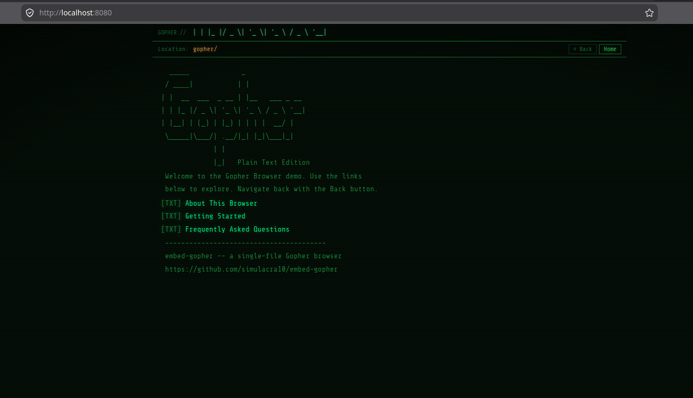

# embed-gopher



A single-file Gopher browser for the web. Drop `index.html` into any static site and your visitors get a retro terminal-style content reader — no build step, no dependencies, no server-side code.

Content is written as plain text files and a simple menu format (gophermap). The browser fetches them over HTTP.

---

## How it works

The browser reads two kinds of files from a static file host:

- **`gophermap`** — a menu file describing links and labels
- **`*.txt`** — plain text files displayed in a pre-formatted viewport

Paths that do not end in `.txt` are treated as directories and trigger a fetch of `<path>/gophermap`. Paths ending in `.txt` are fetched and displayed as text.

---

## Quick start

### 1. Clone the repository

```sh
git clone https://github.com/simulacra10/embed-gopher.git
cd embed-gopher
```

### 2. Copy your content

Put your `gophermap` and `.txt` files somewhere your static host will serve them. The `example/` directory in this repo contains a working sample you can copy as a starting point:

```sh
cp -r example/ /your/site/gopher/
```

### 3. Configure `index.html`

Open `index.html` and find the two variables near the top of the `<script>` block:

```js
var BASE_URL = isLocal
  ? 'http://localhost:8080'        // local dev server
  : 'https://example.com/gopher'; // your production URL

var GOPHER_HOST = 'gopher';       // display string in the address bar
```

Set the production URL to wherever your content files live. `GOPHER_HOST` is cosmetic — it appears in the address bar and can be anything you like.

### 4. Deploy

Copy `index.html` to your site alongside your content directory. It can live anywhere — the same host as the content, a CDN, or a sub-path. The only requirement is that the browser can `fetch()` the content files (see [CORS](#cors) below).

---

## Embedding in a page

**Full-page iframe:**

```html
<iframe src="/gopher/index.html"
        style="width:100%;height:600px;border:none;">
</iframe>
```

**Standalone page:** link directly to `index.html` or use it as the page itself.

---

## Writing content

### Gophermap format

A `gophermap` is a plain text file, one entry per line. Each line begins with a single item-type character, followed by fields separated by **tab** characters.

| Type | Meaning         | Rendered as           |
|------|-----------------|-----------------------|
| `i`  | Info / label    | Dimmed text (no link) |
| `0`  | Text file       | `[TXT]` link          |
| `1`  | Directory/menu  | `[DIR]` link          |

**Full line format:**

```
<type><label>	<selector>	<host>	<port>
```

For a static HTTP host, `host` and `port` are ignored by the browser. Use `fake` and `0` as placeholders.

**Example `gophermap`:**

```
iWelcome to my Gopher hole	fake	fake	0
i	fake	fake	0
0Read the introduction	/intro.txt	fake	0
1More articles	/articles/	fake	0
i	fake	fake	0
iSingle period on its own line ends the menu:
.
```

- A blank `i` line with tab-separated placeholders renders as an empty line.
- A line containing only `.` ends the menu (the browser stops reading there).

### Directory structure

```
gopher/
├── gophermap          ← root menu
├── intro.txt
└── articles/
    ├── gophermap      ← submenu for /articles/
    ├── first.txt
    └── second.txt
```

Selectors in the gophermap should be **absolute paths** from the root of your content directory (e.g. `/articles/first.txt`, not `articles/first.txt`).

---

## Testing locally

Any static file server works. The only requirement is that it serves files from the directory containing your `gophermap` and content files.

**Python (no install needed):**

```sh
cd /your/site
python3 -m http.server 8080
```

Then open `http://localhost:8080/gopher/index.html` in a browser.

**Node.js (`npx serve`):**

```sh
npx serve /your/site -p 8080
```

**VS Code Live Server extension** also works out of the box.

The browser detects `localhost` / `127.0.0.1` automatically and switches to the local `BASE_URL`, so no configuration change is needed between dev and production.

---

## CORS

The browser fetches content using the Fetch API. If `index.html` and the content files are on **different origins**, the content server must send permissive CORS headers:

```
Access-Control-Allow-Origin: *
```

Most static hosts (GitHub Pages, Netlify, Cloudflare Pages) do this by default. If you control an Nginx or Apache server, add the header to the location block serving your content directory.

If `index.html` is served from the same origin as the content (common for self-hosted setups), CORS is not an issue.

---

## Generating content from an existing site

`generate-gophermap.sh` converts an existing site into Gopher content automatically. It supports two modes: **Hugo** (reads Markdown source files) and **HTML** (reads a rendered static site).

Requirements: `bash`, `python3` (stdlib only — no extra packages).

### Hugo mode

Reads every `.md` file in your Hugo `content/` directory, strips front matter and Markdown syntax, and writes `.txt` files plus section gophermaps into the output directory. Draft, archived, and future-dated posts are skipped automatically.

```sh
chmod +x generate-gophermap.sh

# Defaults: reads content/, writes to gopher/
./generate-gophermap.sh

# Override any variable:
CONTENT_DIR=content \
OUTPUT_DIR=static/gopher \
GOPHER_HOST=gopher.example.com \
SITE_URL=https://example.com \
./generate-gophermap.sh
```

**Output layout:**

```
gopher/
├── gophermap          ← root menu
├── posts/
│   ├── gophermap      ← section menu
│   ├── my-first-post.txt
│   └── another-post.txt
└── pages/
    ├── gophermap
    └── about.txt
```

Sections are derived from Hugo's content directory structure. Any top-level subdirectory of `content/` becomes a section with its own submenu.

### HTML mode

Reads rendered HTML files from a directory (e.g. the `public/` output of any static site generator, or hand-written HTML). Strips tags and extracts page titles and body text, then writes `.txt` files and gophermaps.

```sh
# Run Hugo (or your SSG) first to produce the rendered site
hugo

# Then convert it:
MODE=html \
HTML_DIR=public \
OUTPUT_DIR=static/gopher \
GOPHER_HOST=gopher.example.com \
SITE_URL=https://example.com \
./generate-gophermap.sh
```

The root `index.html` is skipped (it becomes the home gophermap). Every other `.html` file is converted. Subdirectories become sections.

### Environment variables

| Variable | Default | Description |
|----------|---------|-------------|
| `MODE` | `hugo` | `hugo` or `html` |
| `CONTENT_DIR` | `content` | Hugo content directory (Hugo mode) |
| `HTML_DIR` | `public` | Rendered HTML directory (HTML mode) |
| `OUTPUT_DIR` | `gopher` | Where generated files are written |
| `GOPHER_HOST` | `localhost` | Host written into gophermap lines |
| `GOPHER_PORT` | `70` | Port written into gophermap lines |
| `BANNER_FILE` | `banner.txt` | Optional ASCII art banner for the home menu |
| `SITE_URL` | _(empty)_ | Appended as a "Main website:" footer in each file |

### Optional banner

If a file named `banner.txt` exists in the working directory, its contents are placed at the top of the home gophermap. Any ASCII art works. If the file is absent the home menu starts with the section links directly.

### Integrating with Hugo

Add the script to your Hugo build step so Gopher content is regenerated every time you publish:

```sh
hugo && ./generate-gophermap.sh
```

The `OUTPUT_DIR` should be somewhere inside your Hugo `static/` directory so the generated files are included in the final build:

```sh
OUTPUT_DIR=static/gopher ./generate-gophermap.sh
```

---

## Customisation

All colours are CSS custom properties in the `:root` block at the top of `index.html`:

```css
:root {
  --green:        #33ff66;
  --green-dim:    #1a8c3a;
  --green-bright: #66ffaa;
  --green-link:   #00ff88;
  --amber:        #ffb347;   /* address bar text */
  --bg:           #050e07;
  --bg-panel:     #040c06;
}
```

The scanline and vignette overlays can be removed by deleting the `body::before` and `body::after` rules.

The font is [Share Tech Mono](https://fonts.google.com/specimen/Share+Tech+Mono) loaded from Google Fonts. For offline use, self-host the font and update the `@import` URL, or replace it with any monospace font.

---

## Supported item types

| Type | Status   |
|------|----------|
| `i`  | Rendered |
| `0`  | Rendered |
| `1`  | Rendered |
| Others (`g`, `I`, `h`, …) | Parsed but not linked |

---

## License

[MIT](LICENSE)

---

## Open Source

embed-gopher is free and open source software, sponsored by [DMX Digital](https://dmxdigital.site/).
